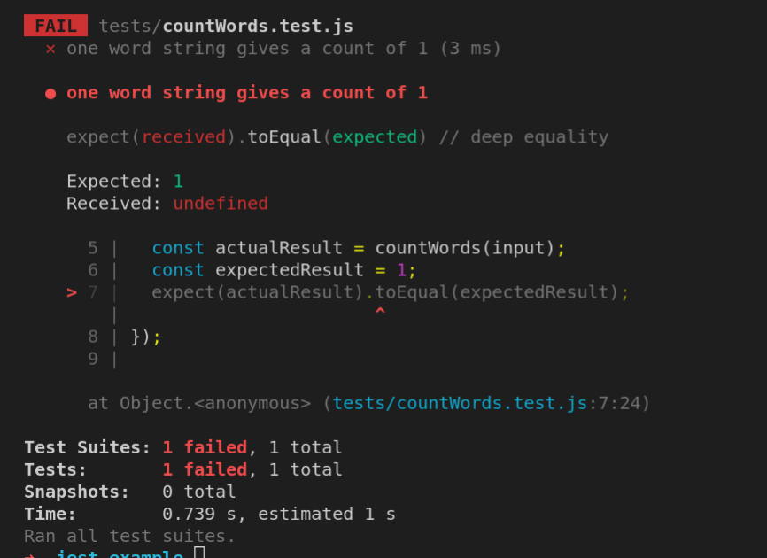
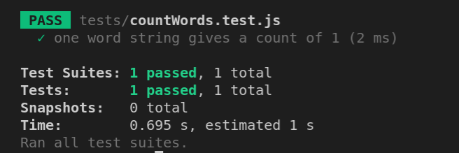

+++
title="Testing"
description="Learn how to test your code"
emoji="🧪"
+++

## What does this cover

This introduction is designed to give you a high-level overview on the basics of testing, which you'll need when you're tackling the problems in your coursework at Code Your Future.
In this introduction to testing we'll cover the following things:

- Why test ?
- Code specification
- What is a test ?
- Anatomy of a test ( using Jest )
- Running tests
- Understanding test feedback ( using Jest )

## Why test ?

Throughout the JS Core modules, we'll use tests in your coursework so it's important you understand what a test is and how they work. The tests will:

- Check whether you've solved the problem
- Guide you towards the correct solution

Tests are also commonly used by professional software developers, so it's useful to start learning early how to read and interpret them.

## Code specification

`countWords` 🧮

Let's consider a function called `countWords` that needs to work as follows:

- it takes one argument - a _string_ of words separated by spaces, e.g. `"hello world"`
- returns an _number_ that counts each word in the string

The points above form a **specification** of how the function `countWords` should behave - in other words, the specification is a **description of how the function should work**. Once we have a specification for how the function should work we can create a number of cases showing how we expect the function `countWords` to behave when it is called with certain inputs.

#### Case 1 💼

```js
const input = "hello";
const result = countWords(input);
```

In example 1, `input` stores a string `"hello"` which we pass as an argument to `countWords`.
We then store the return value of `countWords` in a variable called `result`.
In this case, we would expect the `result` to be 1.

### Case 2 💼

```js
const input = "I think therefore I am";
const result = countWords(input);
```

In example 2, `input` stores a string `"I think therefore I am"`, which we pass as an argument to `countWords`.
We then store the return value of `countWords` in a variable called `result`.
In this case, we would expect the `result` to be 5.

### Exercise 🖊️

Write another example with a different `input` variable. What do you expect the `result` to be in this case ?

We could keep trying out different versions of `input` and check the `result` but real software will often have thousands (or even millions!) of these cases. We can't keep checking all of these ourselves.

This is where automated testing comes in: we could write some more code that checks whether the cases are working as we expect. Let's look at what an automated test looks like.

## 🧪 What is a test ?

We're now ready to define what a test is when we're writing software.

> 🔑 A **test** is any piece of code that **checks a certain unit of code** ( typically a function ) **behaves in a particular way**.

For example, we could write a test to check that `countWords` behaves in a particular way when passed a string containing a single word. For this example, we're using a popular JavaScript testing framework called [Jest](https://jestjs.io/docs/getting-started) to write the test code. We'll examine the example below written using Jest, and then break down the different parts of the test code to understand how it all works.

```js
test("one word string gives a count of 1", function () {
  expect(countWords("hello")).toBe(1);
});
```

Let's break down the different parts of this test code.

## Anatomy of a test

#### 1. Test description

```js
test("one word string gives a count of 1", function () {});
```

We use a function in Jest called `test` to write a test description - `"will count the number of words for a single word string"` which describes the behaviour we expect in this particular test. There is also a function `function () {}` in which we will write our test code. When we run our tests Jest will make the `test` function available in our file without us declaring it.

#### 2. Assertion

```js
expect(countWords("hello")).toBe(1);
```

The assertion is the part of the test code that actually checks to see if something is true or not. In this example, we are claiming that the following is true:

> "We expect `countWords("hello")` **to be** `1`"

Notice that the statement above is very similar to the syntax used in the test code.

The function [`toBe`](https://jestjs.io/docs/expect#tobevalue) ( which is part of the Jest framework ) is used to check that the return value of `countWords("hello")` and `1` are equal to each other. There are [many other functions](https://jestjs.io/docs/using-matchers) like `toEqual` which we can use to make different assertions.

### Pass ✅ or Fail ❌

Finally, our test can either pass or fail.

- If `countWords("hello")` is equal to `1` then the test has passed ✅.
- If `countWords("hello")` is _not_ equal to `1` then the test has failed ❌.

Don't panic if the tests fail!

Remember: tests are here to help you solve the problem! If you carefully read the test feedback it will tell you what the problem is so you can fix it.


### Exercise 🖊️

Try creating another test with a different test description to check how `countWords` behaves in another case.

### Edge cases

When thinking about a specification, and what tests you'll need, you should be thinking both about how people would normally use the function, and about unusual examples that may be confusing or surprising (often called **"edge cases"**). For example, with our `countWords` example, what should happen when an empty string is used as an argument? What should happen for hyphenated words (e.g. `"North-West"`)? Do numbers count as words ? What should `countWords("There were 17 trainees in the North-West class")` return ?

You should make sure you think about these edge-cases when you're approaching a problem, to make sure you solve it completely.

### Exercise 🖊️

Write a test similar to the one above that checks the following behaviour: "numbers aren't counted as separate words in a string"

### Additional setup

We can write tests in lots of different ways. Sometimes developers may write additional variabes in order to label some of the values in the test code more clearly. We could re-write the test above in the following way:

```js
test("one word string gives a count of 1", function () {
  const input = "hello";
  const actualResult = countWords(input);
  const expectedResult = 1;
  expect(actualResult).toEqual(expectedResult);
});
```

In this example, we're declaring some variables that will store values that we compare later on in the test.

- We declare an `input` variable that stores a value that we will pass to the function we are testing - `countWords`.
- We declare an `actualResult` variable that stores the **return value** of our function `countWords`.
- We declare an `expectedResult` which stores what we **expect** the `actualResult` to be when our function is behaving according to the test description.

It's important to note that the test here and the one above it are checking the exact same thing. The variables are just being used to make the test easier to understand for ourselves and other developers.


## Running tests

Let's suppose we have a project with the following project structure:

```raw
project
├── package.json
└── tests
    └── countWords.test.js
```

We have a project with a directory called `tests` containing a file `countWords.test.js` which contains our tests and another file called `package.json` in the root of the project. We need to find out how we can actually use Jest to run the tests so we can see if they're passing or failing.

### Dependencies

We often need to use packages of code written by other developers in our project - otherwise coding would be a very time consuming endeavour indeed! We can download and install these libraries in our project so we can use them when we're building software. We call these libraries of code **dependencies** - libraries of code that **we depend on** when we're **writing our code**. For example, if we're using Jest to write our tests, then we'd say that Jest is one of our dependencies.

### Installing dependencies

`npm` is a tool that is used to download and install dependecies in a project. We can use `npm` to install Jest with the following command:

```bash
npm install --save-dev jest
```

Ensure you're at the root of the project (where the `package.json` is ) before running this command.


You'll learn more about `npm` and how it works later on in the course.


### `node_modules`

Our project structure will now look as follows:

```raw
project
├── package.json
├── tests
|   └── countWords.test.js
└── node_modules
```

Once the installation has completed successfully we should now have a directory called `node_modules` in our project. The `node_modules` directory contains all the code from the dependencies like Jest that we've just installed in our project. You won't really need to look inside the `node_modules` directory - you just need to know it contains the code for Jest and any other libraries we install in our project.

### `package.json`

A `package.json` is a file that contains important details about the project your're working on. It could contain information about the author of the project and other important details too. In order to test our code, we'll need to update the `package.json` so we can run our tests with Jest.

### Running the tests

Finally we'll need to run our tests. We can check the `package.json` for a section called `"scripts"`, see below:

```json
"scripts": {
  "test": "echo \"Error: no test specified\" && exit 1",
},
```

This section is where we'll store some commands that we can use in our project. We'll need to update the `package.json` so that it reads as follows:

```json
"scripts": {
  "test": "jest",
},
```

Now we can run the following command in our terminal ( whilst at the root of our project ):

```bash
npm test
```

This should run our tests and then provide us with feedback about how our code is working.

## Understanding test feedback

Consider an extract from the test file `countWords.test.js`


After the test has run, we will get some feedback from Jest depending on whether the test passed or failed.
If the test fails then we should expect to see something like this:



If the test passes, then we should get some feedback that looks like this:



Jest aims to give feedback that makes it simple to see why test has failed. It shows us several things:

- the line number for the failing test (line 7)
- shows us `expected` - which corresponds to our `expectedResult`
- shows us `received` - which corresponds to our `actualResult`

We can see the test feedback is telling us that `received` is `undefined`. In other words, `actualResult` ( `countWords`'s return value) is `undefined`.

### Exercise 🖊️

How could you update the function `countWords` to ensure it passes the test shown at the top of this section. Hint: Think about the function's **return value**.

## Further reading

- Find out more about Jest by visiting the documentation [here](https://jestjs.io/docs/getting-started)
- You can also check out [Coding Train](https://www.youtube.com/watch?v=S3QwafQEvSs) for more explanations of how tests work
