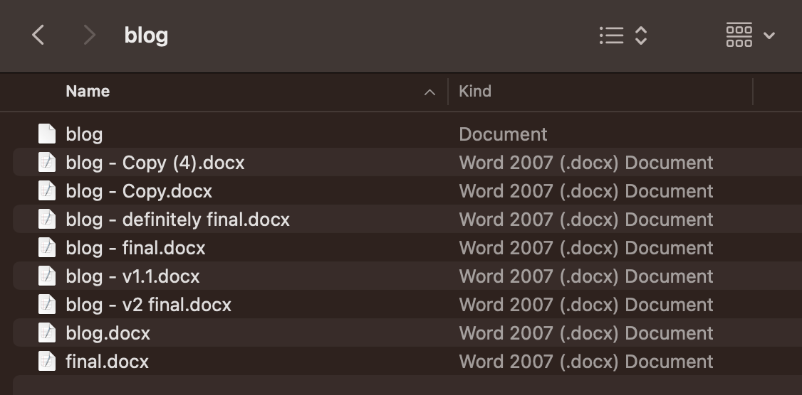
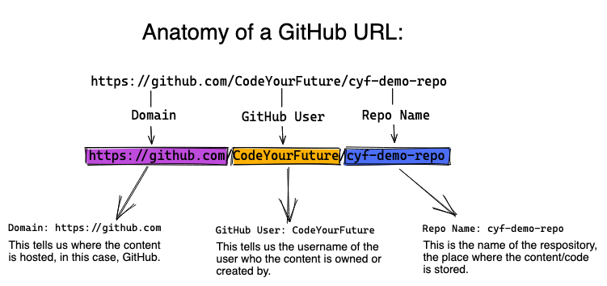

+++
title = 'prep'
description = 'You can use these notes to prepare for the first in-person session of the software development course'
layout = 'prep'
emoji= '📝'
menu_level = ['sprint']
weight = 1
backlog= 'Module-Induction'
backlog_filter= 'Induction'
[objectives]
1='Define a repository'
2='Explain why we use Github'
3='Given a remote or local repository, identify the number of commits'
4='Given a remote or local repository, identify the author, time and message of a given commit'
5='Given a remote or local repository, identify the files and folders from any commit in a version timeline'
6='Describe the purpose of version control'
7='Explain the difference between Git and Github'
8='Get a local copy of a repository on your local machine'
+++

## Learning objectives

## 📝 CYF blog

Imagine that two people are writing a blog.
Ahmed and Naima are writing a blog together about their struggles learning coding.

The published blog is live here 👉 [CYF educational blog](https://git-demo-week1.netlify.app/)


Try exploring the site above. Try clicking on the link on the site and check to see if its working.


## 🧰 Development process

Ahmed and Naima are using the following **development process** for writing their blog:

> - writing the blog in a single file on a **single** computer
> - saving multiple versions of the file on the same computer
> - taking turns to use the computer during the day

At the moment, the computer has a folder with the blog that looks like this:



Describe some of the challenges that Ahmed and Naima face when trying to write a blog together in this way.

Create or join a thread 🧵 on Slack to share your answers. Did your cohort colleagues think of similar things?



## ⌛ Version control software

> To improve their way of working, Ahmed and Naima realise they need the following:
>
> - a way to create and manage the different versions of their project
> - a way to share the history of the project between different users

To manage the different versions of the blog project, they decide to use **Git**.



Git is **version control software** that allows developers to create and manage different versions of a project.



In Git, we create different versions of a project over time by creating a **commit**.

A **commit** is a snapshot of our project at a particular point in time. You can also think of a **commit** as a particular version of a project.

**Commits** store the following information👍

- what changed in this commit
- who created the change
- what time the change happen
- what the previous commit was

A typical timeline of commits might look like this:

## 🗄️ 🌐 Sharing history

Earlier on, Ahmed and Naima realised they also need the following:

> a way to share the history of the project between different users

To share a project and its history, we can use an online platform called **Github**

**Github** is a platform where teams can store projects along with a history of their different versions.

By storing projects on Github, multiple users can gain access to the history of a project.


On Github we call our project and its history a **repository**.




### Explore 🔍

In this exercise, you'll need to explore a **Github repository.**

You'll need to look around and figure out where to find different files and find out information about them.

**⚠️ You won't be expected to know what the files do at this stage.**

Go to the following link: https://github.com/CodeYourFuture/education-blog

It will take you to a Github repository called **education-blog**.

Answer the following questions using the page linked to above:

a) View the **README.md** file. What do the instructions tell you?
b) How many files are there inside the `blogs` folder?
c) How many lines are there in the **package.json** file?
d) Find the file with the blog content you can see on the live site here [blog 1](https://git-demo-week1.netlify.app/blogs/1)

You'll learn more about these type of files throughout the course.



> We can use the Github interface to explore the different **commits** ( versions ) of a project too.



### Explore 🔍

Go to the following link: https://github.com/CodeYourFuture/education-blog/commits/main

Try answering the following questions:

Go to the commit that says "add test p element to index page"

#### Questions

- How many files were changed in this commit?
- Who created the change?
- What time did the change take place?





### Explore 🔍

Go to the following link: https://github.com/CodeYourFuture/education-blog/commits/main

#### Questions:

Go to the commit that says "remove \ and # from start of paragraph"

#### Questions:

- How many files were changed in this commit?
- What change was made in this commit?



## 📜 Previous versions

We can view the different commits of a project on Github.

This means we can see what the website looked like before, in previous versions.



Here are some different versions of the same CYF educational backlog.

[Deployed version A educational blog](https://64b6f9a2b9c00a00082bbeeb--git-demo-week1.netlify.app/)

<!---
Version A should have a test p element on the index page
-->

[Deployed version B educational blog](https://64b6fd80d14d510008aab4aa--git-demo-week1.netlify.app/)

<!---
Version B should have nothing on the index page
-->

[Deployed version C educational blog](https://64b971b0adae9e00089d7531--git-demo-week1.netlify.app/)

<!---
Version C should be same as production deployment but with some rogue characters on the page
-->

#### Questions:

a) What is the difference between Version A and Version B on the index page ( the page you first land on after clicking on the link )
b) What is the difference between Version C and the main version of the site.
c) Which commit from the [**education-blog**](https://github.com/CodeYourFuture/education-blog/commits/main) repo correspond to Version C? Remember to check the git history.
d) Which commit from the [**education-blog**](https://github.com/CodeYourFuture/education-blog/commits/mainLive) repo correspond to Version A?



## 🍴 Forking a repository

Often we want to take an existing project and start working on it independently: in other words, we start making our own versions of the project separate from the original project.

We may have a repo will the following url:

We might want to start creating our version of this project in isolation from the original project.

So we can create a **fork**.


A **fork** is a copy of a repository that exists on Github



When we create a fork on Github, the new forked repository gets a new url:



### 🍴 Forking a repo

Visit the following https://github.com/CodeYourFuture/education-blog.

Firstly locate the **Fork** button on this page.

Click on the Fork button to create a new fork of the repository and set yourself as the owner of the fork.

📋 How can you check you successfully forked the original repository?

Hint: Check the url of your forked repository



## 💻 Working locally

We can also use Git on our local machine to perform similar tasks as we do on Github. So we need to address the following question:



How can we get a copy of an existing Github repository on our local machine?



In other words, we need to get a local copy of the repository on Github.



We call a local copy of a Github repository a **clone**.

The process of copying a remote repository on to a local machine is known as **cloning**.

A repository on Github is said to be **remote**.

A repository on our own computer is said to be **local**.





###

> 🎯 Goal: Clone a remote repository to your local machine

You'll need to use the information below to achieve this goal:

You'll need to clone the following repository 👉 https://github.com/CodeYourFuture/education-blog

Follow through the steps in this video 👉 https://www.youtube.com/watch?v=ILJ4dfOL7zs ( Remember to use the url for the education-blog repo when you are cloning )



## 📘 Viewing the files

Once you've got a local copy of a codebase on your local machine you can start to view the files and folders in that codebase. You can use a code editor like VSCode.

VSCode is an application that enables developers to view and edit files on their local machine.



### Explore VSCode

Figure out how to open the cloned repository on your local machine in VSCode.

Explore the repository in VSCode and use the code editor to look at the various files and folders.

Try opening the Integrated Terminal in your VSCode window



## 🌳 Branching

We can check the commits on the remote repository as before:

On the left page of the page, we see additional information:

> So what is **`main`**?

`main` is a **branch**.

Commits form a sequence that look like this:

```mermaid
gitGraph
       commit
       commit
       commit
```

The **main branch** is a sequence of commits. It represents a particular line of development in a project.



A **branch** is a sequence of commits in a project.



Often we want to start work on a particular change _without_ altering the history in a particular branch.

Instead we can create a new branch to start producing our own work.

We can start to create independent branches like this:

```mermaid
gitGraph
        commit
        commit
        branch "week-1-coursework"
        commit
        commit
        commit
```

In the diagram above, we can continue to commit on the "week-1-coursework" branch without altering the history of the `main` branch.



### Creating a local branch

1. Open the `education-blog` repository in VSCode.

2. [Open the terminal](https://code.visualstudio.com/docs/terminal/basics) in VSCode

3. Use the command line to check your current working directory and list the contents of the current directory. Double check you're in the right place.

4. Using this clip, create a new branch called `update-blog-1` in your local repository 👉 https://youtube.com/clip/UgkxvXsnm_98Rx0NUZq25apQWA6POccRoQzw

📋 How can you check that you've successfully created a branch?


