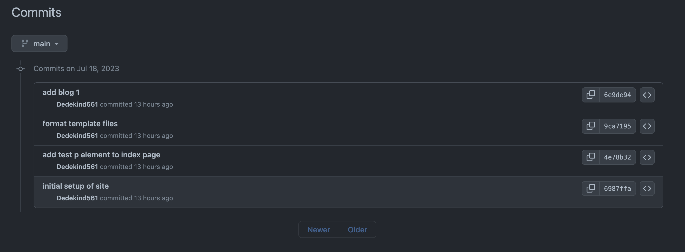
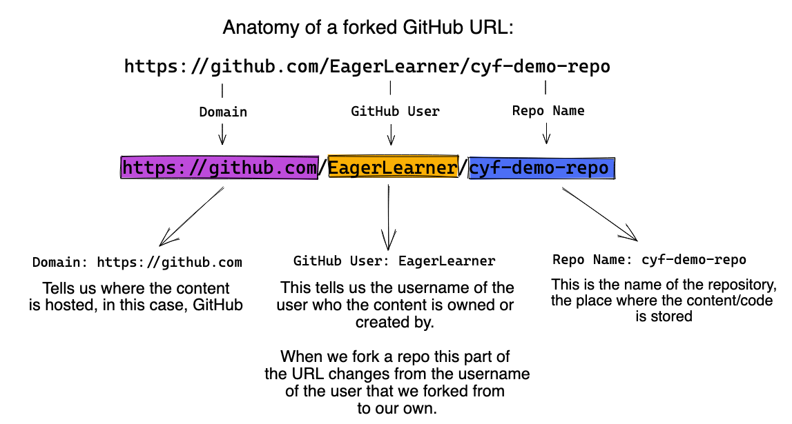

+++
title = 'prep'
description = 'You can use these notes to prepare for the first in-person session of the software development course'
layout = 'prep'
emoji= '📝'
menu_level = ['sprint']
weight = 1
backlog= 'Module-Induction'
backlog_filter= 'Induction'
+++

## Learning objectives

Define a code base
Define a repository
Explain why we use Github
Given a remote or local repository, identify the number of commits
Given a remote or local repository, identify the author, time and message of a given commit
Given a remote or local repository, identify the files and folders from any commit in a version timeline
Describe the purpose of version control
Explain the difference between Git and Github
Get a local copy of a repository on your local machine
Given a local repository, make a local change and inspect the Source Control panel in VSCode
Given a local repository, make some local changes and commit those changes

## 📝 CYF blog

Imagine a scenario where 2 people are writing a blog.
Ahmed and Naima are co-authoring this blog to document the things they're struggling with whilst learning to code.

The published blog is live here 👉 [CYF educational blog](https://git-demo-week1.netlify.app/)


Try exploring the site above. Try clicking around different links on the site and check to see if they're working.


## 🧰 Work process

Ahmed and Naima are currently using the following **work process** for writing the blog:

- writing the blog in a single file on a **single** computer
- saving multiple versions of the file on the same computer
- they take it in turns to the use the computer at different points in the day

At the moment, the computer has a folder with the blog that looks like this:



Describe some of the challenges that Ahmed and Naima face when trying to write a blog together in this way.
Try asking on Slack to see if your cohort colleagues came up with similar answers.



## ⌛ Version control software

> To improve their way of working, Ahmed and Naima realise they need the following:
>
> - a way to create and manage the different versions of their project
> - a way to share the history of the project between different users

To manage the different versions of the blog project, they decide to use Git.



Git is **version control software** that allows developers to create and manage different versions of a project.



In Git, we create different versions of a project over time by creating a **commit**.

A **commit** is a snapshot of our project at a particular point in time. You can also think of a **commit** as a particular version of a project.

**Commits** will give us the following information👍

- what changed in this commit
- who created the change
- what time the change happen
- what the previous commit was

A typical timeline of commits might look like this:

## 🗄️ 🌐 Sharing history

Earlier on, Ahmed and Naima realised they needed the following:

> a way to share the history of the project between different users

To share a project and its history, we can use an online platform called **Github**

**Github** is an online platform where teams can store their projects and histories online.


On Github we call our project and its history a **repository**.




### Explore 🔍

In this exercise, you'll need to explore a **Github repository.**

You'll need to look around and figure out where to find different files and find out information about them.

**⚠️ You won't be expected to know what the files do at this stage.**

Go to the following link: https://github.com/CodeYourFuture/education-blog

It will take you to a Github repository called **education-blog**.

Answer the following questions using the page linked to above:

a) Look at the README.md. Read the instructions on there?
b) How many files are there inside the `blogs` folder?
c) How many lines are there in the **package.json**?
d) Find the file with the blog content you can see on the [live website here](https://git-demo-week1.netlify.app/)



We can use the Github interface to explore the different **commits** ( versions ) of the project.



### Explore 🔍

Go to the following link: https://github.com/CodeYourFuture/education-blog/commits/main

Try answering the following questions:

Go to the commit that says "add test p element to index page"

Try answering the following questions:

- How many files were changed in this commit?
- Who created the change?
- What time did the change take place?



## Different versions

We have a need for a way of creating and managing different versions of our project over time.



Here are some links to the different versions of the same CYF educational backlog

[Version A educational blog](https://64b6fd80d14d510008aab4aa--git-demo-week1.netlify.app)
[Version B educational blog](https://64b6f8e6044ccc0742386430--git-demo-week1.netlify.app/)
[Version C educational blog](https://64b6fd80d14d510008aab4aa--git-demo-week1.netlify.app/)

Answer the following questions:
a) What is the difference between Version A and Version B on the README page.



## 🔍 Check out a commit

What is _in_ a commit? We can recall that a commit is a snapshot of a codebase. Therefore, we should be able to check out the codebase at a given point in the timeline and look at the files and folders there. We can use the Github website to not only see the different **commits** in our project - we can also check out the files and folders at a given point in the history.



Go back to this page GITHUB_REPO_URL to look at the following:

and look at one of the commit with hash "d3567h" and then look for the icon that that says "Browse the repository at this point in the history".

Do the same but for the commit "edf89".



## 🍴 Forking a repository

Often we want to take an existing project and start working on it independently: in other words, we start making our own versions of the project separate from the original project.

We may have a repo will the following url:

We might want to start creating our version of this project in isolation from the original project.

So we can create a **fork**.


A **fork** is a copy of a repository that exists on Github



When we create a fork on Github, the new forked repository gets a new url:



Visit the following https://github.com/CodeYourFuture/education-blog and firstly identify the Fork button.

Click on the Fork button to create a new fork of the repository and set yourself as the owner of the fork.



## 💻 Working locally

We can use Github to view and manage repositories. However, we can also work with repositories locally. **Locally** means taking a copy of a repository on Github and downloading it on to our local machine where we can look around and make changes without being on Github.



🔍 Figure it out - in this exercise, you'll need to figure out how to do something. Even though it is a little unfamiliar.

Firstly,

1. Open a terminal on your computer.

For each of the steps below, you'll need to use your terminal to carry out the commands below.
You can use the [documentation](https://www.techrepublic.com/article/16-terminal-commands-every-user-should-know/)

2. Print your current working directory.
3. List the files and folders in your current working directory.

You'll need a place to store the repositories you'll use on the CYF course.

4. Make a new directory called `cyf` in your home directory.
5. Change directory into the `cyf` directory.
6. Using the terminal, use a command to create a new directory called "CYF". You'll use this directory to store the files and folders in your project.
7. Change your working directory to the "CYF" directory.



## Going local

However, we can also use Git on our local machine to perform similar tasks as we do on Github. The first task we have is This

> ? How can we get a local copy of an existing Github repository on our local machine.

In other words, we need to get a copy of the codebase on Github on to our device.



## 👣 Follow the steps

> 🎯 Goal: Clone a remote repository to our local machine

You'll need to follow the steps below so we can achieve the following goal:

You'll need to clone the following repository 👉 https://github.com/CodeYourFuture/cyf-demo-repo

To achieve this goal, follow through the steps in this video 👉 https://www.youtube.com/watch?v=ILJ4dfOL7zs



## 📘 Viewing the files

Once you've got a local copy of a codebase on your local machine you can start to view the files and folders in that codebase. You can use a code editor like VSCode; VSCode is an application that enables developers to view and edit files on their local machine.



Figure out how to open the cloned repository on your local machine in VSCode. Explore the repository in VSCode and use the code editor to look at the various files and folders.



## Source Control

We can use the **Source Control** tab in VSCode to manage the commits in our project.
Check out this video to familarise yourself about the VSCode source control panel ahead of Saturday's session.




