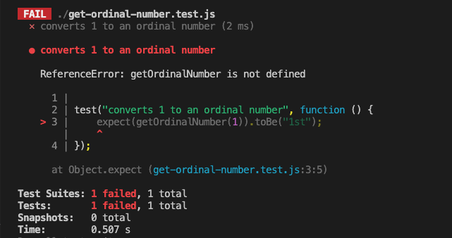

+++
title = '💼 First test case'
headless = true
time = 30
facilitation = false
emoji= '🧩'
[objectives]
    1='Outline the effect of running npm test'
    2='Interpret documentation to determine how part of an 3rd API behaves'
    3='Describe what `toBe` checks in the Jest library'
    4='State the current return value of a function and the target output for a given test'
    5='Implement a test case to describe the behaviour of a function'
    6='Determine the line an error occurred from some test output'
+++

> 🎯 Goal: Write the a test for the case below, using Jest:

- Case 1 💼

```js
const input = 1;
const currentOutput = getOrdinalNumber(input);
const targetOutput = "1st";
```

To work out how to write a test using Jest, we can check out the documentation.

We can create a file called `get-ordinal-number.js` and in there write our first test.
We can figure out how to write this test using the Jest documentation. We can start writing a test:

get-ordinal-number.test.js

```js
test("converts 1 to an ordinal number", function () {});
```

Let's break down this syntax.
The `test` function is part of the Jest API: it is an interface we use to perform a particular task.
In particular, we're using `test` to create a test case.

Let's break down the arguments we're passing to `test`:

- 1st argument: `"converts 1 to an ordinal number"`, which describes the behaviour we're testing for
- 2nd argument: `function () {}`, we will write some assertions in this `function () {}` to check the behaviour

### ⚖️ Creating assertions

Now we have

get-ordinal-number.test.js

```js
test("converts 1 to an ordinal number", function () {});
```

We need to write an **assertion** inside the body of `function () {}`

> 🗣️ Recall: The assertion is the part of the test code that actually checks to see if something is true or not.

In this example, we want to check that the following is true:

We expect `getOrdinalNumber(1)` to be `"1st"`

An assertion in Jest looks like this:

```js
expect(getOrdinalNumber(1)).toBe("1st");
```

The function `toBe` is used to check that the current output of `getOrdinalNumber(1)` and the target output of `"1st"` are equal to each other.
`toBe` is just one example of a function called a [matcher](https://jestjs.io/docs/using-matchers).
A matcher is a function we use to compare values in Jest.

So we can combine this with the test we wrote earlier, to get our first complete test case:

```js
test("converts 1 to an ordinal number", function () {
  expect(getOrdinalNumber(1)).toBe("1st");
});
```

### 👟 Running tests

We can try running the file index.test.js with node in the following way:

```bash
node index.test.js
```

but we get an error:

```bash
ReferenceError: test is not defined
```

This is because `test` isn’t defined anywhere in the file.

So we need to execute this file so that the Jest API is available in our file. We can do this by adding executing the test file using Jest: we do this using an npm script.

The "scripts" section of the `package.json` is where we can write useful commands we'll use in our project. We can add a "scripts" section to the `package.json` so that it reads as follows:

```json {linenos=table,hl_lines=["4-6"],linenostart=1}
{
  "name": "week-4-test-example",
  "description": "An example application showing how to write tests using the jest framework",
  "scripts": {
    "test": "jest"
  },
  "devDependencies": {
    "jest": "^29.5.0"
  }
}
```

Finally, we'll need to run our tests.
Now we can run the command `npm test`.

When we execute the command, `npm test`, the command will look inside the "scripts" section of the package.json and look up the commmand for "test" - in this case, "jest".

### Understanding test feedback

We currently have a project structure like this:

```raw
week-4-test-example
├── get-ordinal-number.test.js
├── package.json
├── package-lock.json
└── node_modules

1 directory, 3 files
```

And `get-ordinal-number.test.js`
looks like this

```js
test("converts 1 to an ordinal number", function () {
  expect(getOrdinalNumber(1)).toBe("1st");
});
```

After running the test above, we should get feedback indicating whether or not the test has passed.


Predict what the test feedback will say when the test above is executed.


### 🚢 Defining the function

At the moment, our test feedback gives the following:



The test code is throwing a **ReferenceError**.

We can define `getOrdinalNumber` in our test file.

```js
function getOrdinalNumber() {}

test("converts 1 to an ordinal number", function () {
  expect(getOrdinalNumber(1)).toBe("1st");
});
```

Now we can run the tests again and check the test feedback.

### Assertion errors

We now get the following feedback:


Jest tells us 3 main things:

1. The test case that failed
2. The targetOutput and the currentOutput
3. The line number where error occurred

Jest defines **Expected** and **Received** in the test feedback:

- Received: `undefined`
- Expected: "1st"



What are the values of Expected and Received in the test output?
How do Received and Expected match up with the targetOutput and expectedOutput ?

What line number did the test case fail on?



### Passing `getOrdinalNumber`

We can now make the test pass by implementing functionality for the first test case.
We could write the following:

get-ordinal-number.test.js

```js {linenos=table,hl_lines=["2"],linenostart=1}
function getOrdinalNumber() {
  return "1st";
}

test("converts 1 to an ordinal number", function () {
  expect(getOrdinalNumber(1)).toBe("1st");
});
```
