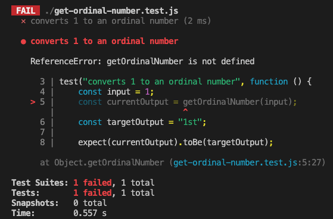
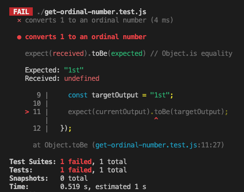

+++
title = '✅ ❌ Interpreting feedback'
headless = true
time = 25
facilitation = false
emoji= '🗄️'
[objectives]
    1='Identify current output and target output in test output'
    2='Determine the line an error occurred from some test output'
+++

We currently have a project structure like this:

```raw
week-4-test-example
├── get-ordinal-number.test.js
├── package.json
├── package-lock.json
└── node_modules

1 directory, 3 files
```

And `get-ordinal-number.test.js`
looks like this

```js
test("converts 1 to an ordinal number", function () {
  const input = 1;
  const currentOutput = getOrdinalNumber(input);
  const targetOutput = "1st";

  expect(currentOutput).toBe(targetOutput);
});
```

After running the test above, we should get feedback indicating whether or not the test has passed.


Predict what the test feedback will say when the test above is executed.


### 🚢 Defining the function

At the moment, our test feedback gives the following:



The test code is throwing a A **ReferenceError** occurs when we try to reference a variable that we've not defined in our code.

This means that we haven't defined a function named `getOrdinalNumber`, but we're trying to use it.
To fix this, we can define `getOrdinalNumber` in our test file.

```js
function getOrdinalNumber() {}

test("converts 1 to an ordinal number", function () {
  expect(getOrdinalNumber(1)).toBe("1st");
});
```

Now we can run the tests again and check the test feedback.

### Assertion errors

We now get the following feedback:



Jest tells us 3 main things:

1. The test case that failed
2. The target output and the current output
3. The line number where error occurred

Jest defines **Expected** and **Received** in the test feedback:

- Expected: "1st"
- Received: `undefined`



What are the values of **Expected** and **Received** in the test output?

How do **Received** and **Expected** match up with the target output and expected output ?

What line number did the test case fail on?



### Passing `getOrdinalNumber`

We can now pass the test by implementing functionality for the first test case.
We could write the following:

get-ordinal-number.test.js

```js {linenos=table,hl_lines=["2"],linenostart=1}
function getOrdinalNumber() {
  return "1st";
}

test("converts 1 to an ordinal number", function () {
  const input = 1;
  const currentOutput = getOrdinalNumber(input);
  const targetOutput = "1st";

  expect(currentOutput).toBe(targetOutput);
});
```
