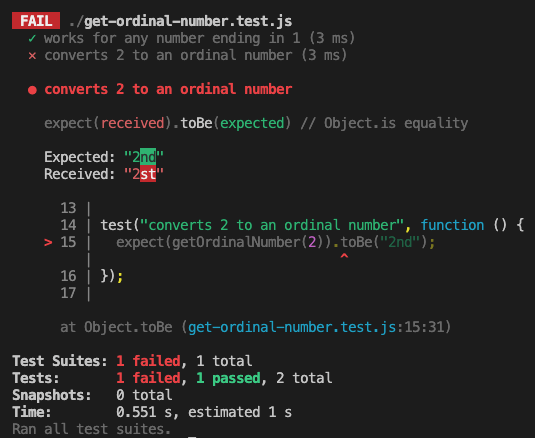

+++
title = '🗄️ Generalising further'
headless = true
time = 30
facilitation = false
emoji= '🧩'
[objectives]
    1='Describe how to generalise a solution from a set of inputs'
+++

In English, ordinal numbers mostly follow the same pattern.

> Numbers ending in 1 will generally have an ordinal number ending in "st".

Here are some examples of this pattern,

1st, 11**th**, 21st, 31st, 41st,...

All the numbers ending in 1 will continue to end in `"st"`, with the exception of 11.
11 is slightly different and ends with a `"th"`.

We can now create a test case to check that `getOrdinalNumber` works for _any_ number ending in 1.

get-ordinal-number.test.js

```js {linenos=table,hl_lines=["5-9"],linenostart=1}
function getOrdinalNumber() {
  return "1st";
}

test("works for any number ending in 1", function () {
  expect(getOrdinalNumber(1)).toBe("1st");
  expect(getOrdinalNumber(11)).toBe("11th");
  expect(getOrdinalNumber(21)).toBe("21st");
});
```

We've also updated the test description because we're adding more assertions and checking slightly different functionality.



What do you think the test output will be when the test runs? Remember to think in terms of `targetOutput` and `currentOutput`.

How can you approach implementing the logic for this function each time?

Can we add any more assertions to this test case?



### 🧰 Handling outliers

We can now implement functionality for `getOrdinalNumber`.

Our strategy might be something like this:

```mermaid

flowchart LR

A{Check is num 11} -- true --> B[return 11th]
A -- false --> C[return num + st]
```

Most of the time we just need to return the number with "st" on the end.

However, 11 is an outlier: it doesn't conform to this pattern.

So our current strategy for this test case will be to check if the number is 11 first and do something differently ( return `"11th"` ): otherwise we return the default value of num with `"st"` on the end.

Here's the implementation:

```js {linenos=table,hl_lines=["1-5"],linenostart=1}
function getOrdinalNumber(num) {
  if (num === 11) {
    return "11th";
  }
  return `${num}st`;
}

test("works for any number ending in 1", function () {
  expect(getOrdinalNumber(1)).toBe("1st");
  expect(getOrdinalNumber(11)).toBe("11th");
  expect(getOrdinalNumber(21)).toBe("21st");
});
```

###  🧭 Future strategies

Now, we've handled any numerical inputs ending in 1. We can try to build up functionality for _any_ number ending in 2.

We can start by adding a test case that only asserts something about the input of 2.

We cannot add this assertion to the first test case. The first test case checks for inputs that end in a 1.
To check the case when the input ends in 2, we need to introduce a new test case.

```js {linenos=table,hl_lines=["14-16"],linenostart=1}
function getOrdinalNumber(num) {
  if (num === 11) {
    return "11th";
  }
  return `${num}st`;
}

test("works for any number ending in 1", function () {
  expect(getOrdinalNumber(1)).toBe("1st");
  expect(getOrdinalNumber(11)).toBe("11th");
  expect(getOrdinalNumber(21)).toBe("21st");
});

test("converts 2 to an ordinal number", function () {
  expect(getOrdinalNumber(2)).toBe("2nd");
});
```





### Check the test output

Here's the test feedback for the test above:


**Play computer** with `getOrdinalNumber` when it is called with an input of 2
Double check you agree with the test feedback in this case.

Before coding, outline a strategy for handling the second test case.







Try updating the second test case to check `getOrdinalNumber` works for any numerical input ending in 2.





