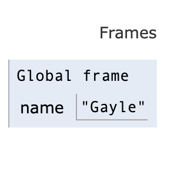

+++
title = '💻 Playing computer'
headless = true
time = 10
facilitation = false
emoji= '🗄️'
[objectives]
    1='Analyse each line in a given program and state what the line does when the program executes'
+++

To understand how `convertToPercentage` works we must build a mental model of how the computer executes our code. To make sense of how the computer executes our code, we use a method called **Playing computer** means simulating how the computer executes our code. We "step through" the code, line by line, and work out what the computer does when it follows each instruction.

### ➡️ Current line of code

We will use execution diagrams to step through our code. First, we need to track the line of code that is **currently executing**.



In the interactive widget, an arrow shows which line of code is being executed. Each line is an instruction to the computer that will produce some effect. For example, a line of code with a variable declaration means "store a new variable with this value".

Choose _next_ to see what happens when the computer executes the variable declaration.

<iframe width="800" height="300" frameborder="0" src="https://pythontutor.com/iframe-embed.html#code=const%20name%20%3D%20'Gayle'%3B&codeDivHeight=400&codeDivWidth=350&cumulative=false&curInstr=0&heapPrimitives=nevernest&origin=opt-frontend.js&py=js&rawInputLstJSON=%5B%5D&textReferences=false" title="Interactive Execution Diagram"> </iframe>



### 🖼️ Storing things in memory



As variables are declared, we need a way to track the memory stored as our program executes. In our diagrams, we keep track of memory using a _frame_.

For now, we can think of a frame as a space in our diagram that represents the variables stored in memory.

The _global frame_ is always the first frame that gets created when our program starts executing. We can think of the _global frame_ as a location for variables created outside of any function. When we run the variable declaration above, we get a string `"Gayle"` stored in the Global frame.

Point to the global frame in the visualiser, and then [compare to the image in the tab](#memory-frames-1) to check your answer.






### 📲 Calling functions

So far, we've seen two things:

- lines of code are executed from top to bottom
- we keep track of variables stored in memory using a global frame

We've also got to think about what happens when we declare and call a function in our program. The first thing in this program is the function declaration for `makeGreeting`[^1]. On line 7 we have a function call:

```js {linenos=table,hl_lines=["7"],linenostart=1}
function makeGreeting() {
  const greeting = "Hello there!";
}

const firstName = "German";
const lastName = "Bencci";
makeGreeting();
```




<iframe width="850" height="375" frameborder="0" src="https://pythontutor.com/iframe-embed.html#code=function%20makeGreeting%28%29%20%7B%0A%20%20%20%20const%20greeting%20%3D%20%22Hello%20there!%22%3B%20%0A%7D%0A%0Aconst%20firstName%20%3D%20'German'%3B%0Aconst%20lastName%20%3D%20'Bencci'%3B%0A%0AmakeGreeting%28%29%3B&codeDivHeight=400&codeDivWidth=350&cumulative=false&curInstr=0&heapPrimitives=nevernest&origin=opt-frontend.js&py=js&rawInputLstJSON=%5B%5D&textReferences=false"> </iframe>



🤔 Our diagram shows what happens to the current executing line when a A **function call** means "carry out the instructions in the body of this function". Use the diagrams to work out what happens when `makeGreeting` is called on line 7.

1. What happens to the arrow?
1. What else do you notice when `makeGreeting` is called?





1. The arrow pointing to the current line of execution moves to the first line inside the function; this shows that the computer is now running the instructions inside the function.

2. Another frame is created when we call `makeGreeting`:


Like the global frame, the `makeGreeting` frame will track variables that are created when `makeGreeting` is executed.



### 📥 Returning from a function

To get our answers out of our function, we need to write a return statement with a return value. Our return statement defines the value a function call evaluates to.

<iframe width="800" height="450" frameborder="0" src="https://pythontutor.com/iframe-embed.html#code=function%20makeGreeting%28%29%20%7B%0A%20%20%20%20const%20greeting%20%3D%20%60Hello%20there%60%3B%0A%20%20%20%20return%20greeting%3B%0A%7D%0A%0Aconst%20firstName%20%3D%20'German'%3B%0Aconst%20lastName%20%3D%20'Bencci'%3B%0A%0A%0A%0AmakeGreeting%28%29%3B&codeDivHeight=400&codeDivWidth=350&cumulative=false&curInstr=0&heapPrimitives=nevernest&origin=opt-frontend.js&py=js&rawInputLstJSON=%5B%5D&textReferences=false"> </iframe>

The visualiser shows us that the `return` keyword makes other things happen too. It also tells us to "return" to the place in our code where the function was called. Use the interactive diagram to work out what happens when the computer executes the return statement.

### 🧩 Putting everything together

So now we have a better model of how the computer executes our code, we can apply these ideas to our current implementation of `convertToPercentage`:

<iframe width="800" height="450" frameborder="0" src="https://pythontutor.com/iframe-embed.html#code=function%20convertToPercentage%28%29%20%7B%0A%20%20const%20decimalNumber%20%3D%200.5%3B%0A%20%20const%20percentage%20%3D%20%60%24%7BdecimalNumber%20*%20100%7D%25%60%3B%0A%20%20return%20percentage%3B%0A%7D%0A%0Aconst%20output1%20%3D%20convertToPercentage%280.5%29%3B%0Aconst%20output2%20%3D%20convertToPercentage%280.231%29%3B&codeDivHeight=400&codeDivWidth=350&cumulative=false&curInstr=0&heapPrimitives=nevernest&origin=opt-frontend.js&py=js&rawInputLstJSON=%5B%5D&textReferences=false"> </iframe>



When the computer executes this code, we get:

```bash
50%
50%
```

Use the interactive widget to "play computer" again. Step through each line of code and explain why the program is giving this output.



### 🧪 Checking our code

```js {linenos=table,hl_lines=[7] ,linenostart=1}
function convertToPercentage() {
  const decimalNumber = 0.5;
  const percentage = `${decimalNumber * 100}%`;
  return percentage;
}

const output1 = convertToPercentage(0.5);
const output2 = convertToPercentage(0.231);
```

#### Groundhog day

When the function `convertToPercentage` is called, the variable `decimalNumber` is created in the `convertToPercentage` frame and set to `0.5`. This happens every time we call the function.

We want to give our function `convertToPercentage` a _new_ number each time.

[^1]: `makeGreeting` is stored in the Global frame as an Objects are a data type in JavaScript. We will return to objects in more depth later.
