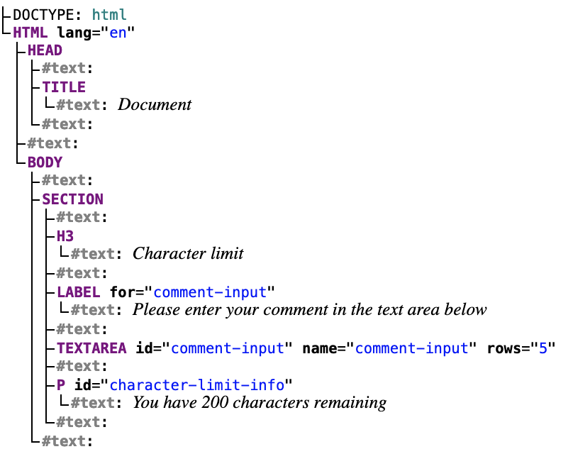

+++
title = '🌲 Interacting with the page'
headless = true
time = 20
facilitation = false
emoji= '🧩'
[objectives]
    1='Define the Document Object Model'
+++

Let's consider the starting html. We need a way of interacting with the elements of a web page once it is rendered on our screens.

```html
<!DOCTYPE html>
<html lang="en">
  <head>
    <meta charset="UTF-8" />
    <meta name="viewport" content="width=device-width, initial-scale=1.0" />
    <title>Document</title>
  </head>
  <body>
    <section>
      <h3>Character limit</h3>
      <label for="comment-input"
        >Please enter your comment in the text area below
      </label>
      <textarea id="comment-input" name="comment-input" rows="5"></textarea>
      <p id="character-limit-info">You have 200 characters remaining</p>
    </section>
  </body>
</html>
```

### 🌳 HTML tree

HTML documents form a [tree-like structure](https://en.wikipedia.org/wiki/Tree_structure). We start at the top `html` element and from there other html elements are nested inside.



### Document Object Model

When the browser first renders a web page it creates the DOM - short for The **D**ocument **O**bject **M**odel is a data representation of the content in a web page. All html elements are represented as objects that can be accessed, modified and deleted.. We can then write JavaScript programs with the DOM API to interact with the elements in the web page.





We can use Dev Tools to inspect the DOM and look at the elements on the page.
Use Dev Tools to inspect the character limit component from earlier. Which html elements make up the character limit component.




